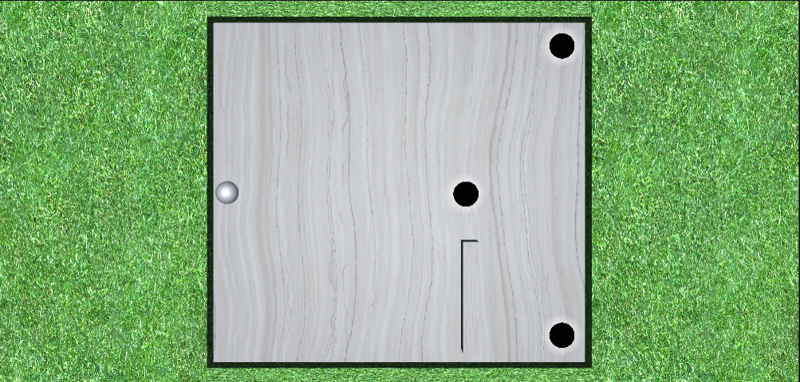
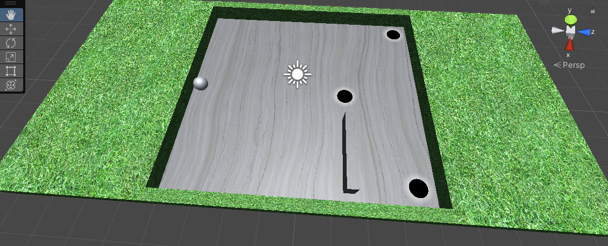
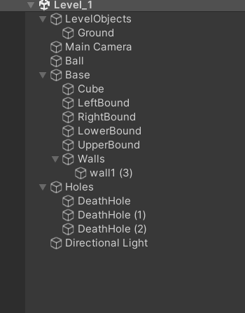
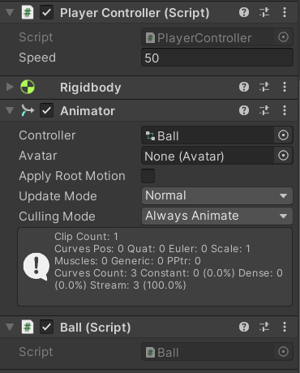
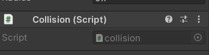

# Unity-Ball-Accelerometer

### Labyrinth Maze Game with Accelerometer and Death Hole

Note! : Scripts only

### Interface

## Prerequisite

- Create the walls base as well as the Ball object.
- Instead of creating 3d holes, I have used 2d png image of Death hole which will be used to eliminate the ball as soon as the collision occurs.

    

Use an accelerometer as a game controller to control the ball object in Unity.

1) Download the scripts

2) Add Ball and Player Controller script to the Ball object as shown.

3) Add collision script to the Death hole.

✨Magic ✨

**Free Scripts, Hell Yeah!**
